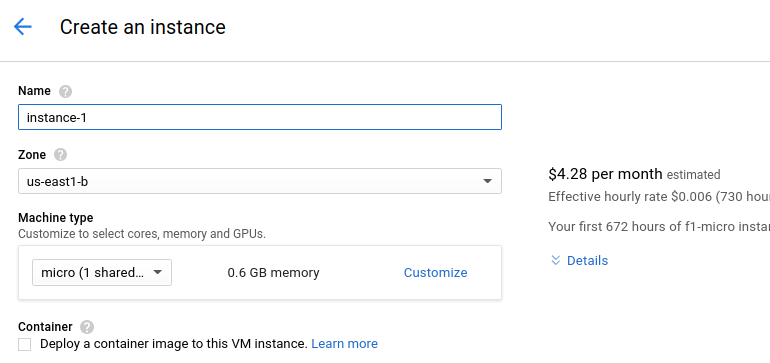

## The Gcloud assignment

Make a new `webserver` repo on your github user, then


Make an index.html


For Dockerfile:


Got Dockerfile and index?


Ok ready for next part

#### > create dockerhub account [hub.docker.com](http://hub.docker.com)


`Create automated build`


Select the repo


Go to "Build Settings" and hit the trigger button for master:


Done with the docker stuff for now.

## Now to Google Cloud

Get dat URL from the lectures repo.


Set up yer account


Nah let's do this the easy way...


To the web interface!

Select a new cs340 project


K done now make a compute instance using that button earlier.


Hmm this seems to be taking awhile...

Ok done.


"Create"



Check the "Deploy a container image" so that we can use our docker container.

Remember this?


Put that title into this:


Add HTTP for the firewall:


Click that more config stuff dropdown:


Now add this into the boot script: (modify it first)

```
#!/bin/bash
docker rm ws
docker run -d --name ws -p80:80 YOURGITHUBUSER/webserver
```


Done here.


Being created:


Done:


Click on that IP: WEBSITE!

E.x. [http://35.196.184.168/](http://35.196.184.168/)
